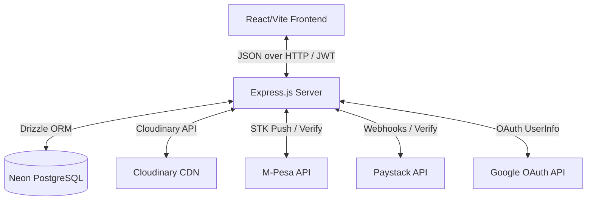

# Lustre Dating Platform: Comprehensive Feature Audit

This document provides a detailed technical audit of the **Lustre Dating Platform**, covering both the backend services (PostgreSQL/Drizzle Schema, Express modules, payment providers, and stored procedures) and the frontend application (Vite/React architecture, custom hooks, user routes, and premium gating mechanics).

---

## 🏛️ 1. Core Architecture Overview

Lustre is built as a high-fidelity dating platform with a focus on privacy, curated match exploration, and an integrated referral/affiliate network.



### Key Technical Specs:
*   **Frontend**: React (Vite), TypeScript, Tailwind CSS, Shadcn UI, Lucide React, Framer Motion, React Router v6, TanStack Query (React Query) v5.
*   **Backend**: Node.js, Express, TypeScript, JWT (Access token 15m, Refresh token 7d), Multer.
*   **Database**: PostgreSQL hosted on Neon DB, managed via Drizzle ORM.
*   **Third-party Services**: Cloudinary (profile photo storage), Safaricom M-Pesa (sandbox mobile money integration), Paystack (card payments/webhooks), Google OAuth 2.0.

---

## 🗄️ 2. Database Schema Audit

The database relies on Drizzle ORM mappings targeting PostgreSQL. It features custom enums, atomic relational constraints, and indexation for performant queries.

### 2.1 Custom PostgreSQL Enums
1.  `gender`: `["male", "female", "non_binary", "other"]`
2.  `orientation`: `["straight", "gay", "bisexual", "other"]`
3.  `intent`: `["casual", "friendship", "relationship", "dating", "friends", "one_night", "unspecified"]`
4.  `subscription_status`: `["active", "expired", "cancelled"]`
5.  `payment_status`: `["pending", "completed", "failed"]`
6.  `premium_tier`: `["free", "basic", "full"]`
7.  `like_type`: `["standard", "super"]`
8.  `notification_event`: `["match", "like_batch", "super_like", "stale_match", "re_engagement", "like"]`
9.  `referral_status`: `["pending", "converted", "paid", "expired"]`
10. `earnings_status`: `["pending", "available", "withdrawn", "cancelled"]`
11. `withdrawal_status`: `["requested", "processing", "completed", "rejected"]`

### 2.2 Relational Schema Table Breakdown

| Table Name | Primary Key | Key Columns / Constraints | Description |
| :--- | :--- | :--- | :--- |
| **`users`** | `id` (Serial) | `email` (unique), `googleId` (unique), `referredBy` (FK to `users.id`), `premiumTier`, `ghostMode` (bool), `totalEarnings` | Stores core auth credentials, social logins, current premium tier, and financial wallet balances. |
| **`profiles`** | `id` (Serial) | `userId` (unique FK), `gender`, `birthDate` (timestamp), `location` (city string), `latitude`/`longitude`, `photoCount` | Stores secondary personal demographics, location coordinates, and completion metrics. |
| **`photos`** | `id` (Serial) | `userId` (FK to `users.id`), `url`, `isMain` (bool) | Table mapping representing uploaded photo URLs. (Note: Primary profile photos array metadata is also stored inside `users.photos` as `jsonb` array of `{ url, public_id }` for atomic fetches). |
| **`user_preferences`**| `userId` | `interestedInGenders` (text array), `minAge`, `maxAge`, `maxDistanceKm`, `intentPreference` | Matchmaking filter presets utilized by discovery and recommendation ranking pipelines. |
| **`likes`** | `id` (Serial) | `fromUserId`, `toUserId`, `type` (standard/super), `expiresAt`, `isSeen` | Tracks single-direction swipe signals. |
| **`passes`** | `id` (Serial) | `userId`, `passedUserId`, `reSurfaceAt` (timestamp) | Tracks explicit pass actions (expires/surfaces again in 30 days unless marked permanent). |
| **`matches`** | `id` (Serial) | `userOneId`, `userTwoId`, `userOneRevealConsent`, `userTwoRevealConsent`, `compatibilityScore` | Mutual connections generated by bidirectional likes. Gated contact reveal switches. |
| **`subscriptions`** | `id` (Serial) | `userId` (FK), `status` (subscriptionStatusEnum), `endDate` | Details date validity periods for user premium privileges. |
| **`payments`** | `id` (Serial) | `userId` (FK), `amount` (KES), `provider` (mpesa/paystack), `providerRef` (unique token), `status` | Direct payment invoices mapping checkout requests to user wallets. |
| **`referral_codes`** | `id` (Serial) | `userId` (FK), `code` (varchar(8) unique) | Unique case-insensitive referral tokens assigned to every account for sharing. |
| **`referrals`** | `id` (Serial) | `referrerId`, `referredId` (unique), `status` (pending/converted/paid/expired) | Connects referring users to new invitees. Tracks milestones from registration to purchase. |
| **`affiliate_earnings`**| `id` (Serial) | `userId`, `amount` (KES 50), `referralId` (FK), `status` (pending/available/withdrawn/cancelled) | Ledger storing referral-derived rewards earned by affiliates. |
| **`withdrawals`** | `id` (Serial) | `userId`, `amount`, `withdrawalStatus`, `paymentReference` | Outbound bank/M-Pesa cashout orders processed by administration. |
| **`notifications`** | `id` (Serial) | `userId`, `type` (notificationEventEnum), `content`, `isRead` | System feed events to notify users about matching updates. |
| **`blocks`** | `id` (Serial) | `blockerId`, `blockedId` | Gating table to isolate members and restrict chats/feeds from each other. |

---

## ⚙️ 3. Backend API Module-by-Module Audit

All endpoints require a valid JWT Bearer Token (`Authorization: Bearer <token>`) except where marked as **Public** or **Optional Auth**.

### 3.1 Authentication (`/api/auth`)
*   `GET /referral?ref=CODE`: Checks referral code validity. Sets a secure client cookie (`referral_code`) lasting 30 days.
*   `POST /send-otp`: Generates a random 6-digit verification code. Persists request with a 15-minute expiry in `email_verification_codes` and dispatches it via nodemailer.
*   `POST /register`: Registers a new user.
    *   Validates OTP from `email_verification_codes`.
    *   Generates a unique 8-character uppercase referral code.
    *   Checks registration cookies or request body for referrer tracking; records a pending attribution in `referrals` if valid (with self-referral blocks).
    *   Creates matching rows in `profiles` and `user_preferences`.
*   `POST /login`: Validates password credentials and issues JWT Access Token (15m) + Refresh Token (7d).
*   `POST /refresh`: Accepts valid refresh token and issues replacement session pairs.
*   `POST /google`: Validates a Google OAuth Client Access Token against Google UserInfo API. Handles silent account linking if the email matches an existing account, else proceeds with account creation, referral tracking, and profile setup.

### 3.2 Profile Management (`/api/profile`)
*   `GET /me`: Performs automated premium status synchronization (checks subscription expiration) and returns complete profile datasets including Cloudinary photos, matching metrics, and preference arrays.
*   `PUT /`: Updates user demographics and coordinates.
    *   Performs phone number regex validations and instagram handle trimming.
    *   Converts age values directly into standard Gregorian `birthDate` timestamps for accurate age filter checks.
    *   Upserts preferences to `user_preferences`.
*   `POST /photos`: Accepts image files up to 5MB (JPG, PNG, WEBP), checks that current user photo counts are < 6, uploads payload to Cloudinary directory `lustre/profile-photos/:userId`, and appends metadata object `{ url, public_id }` to `users.photos` arrays.
*   `DELETE /photos`: Deletes image metadata from the `users.photos` array, decreases photo count in profiles, and invokes Cloudinary SDK to permanently purge the binary asset. Requires file ownership checks (`public_id` path match).

### 3.3 Discovery (`/api/discovery`)
*   `GET /users`: Paginated exploration feed.
    *   *Restrictions*: Synchronizes premium tier first. Non-premium users are blocked with `403 Forbidden` from browsing the active grid.
    *   *Logic*: Filters out blocked members, ghost mode accounts, and self. Computes distance in kilometers between coordinates. If distance exceeds the user's `maxDistanceKm` preference, candidate is excluded. Falls back to string-based city matching if coordinates are absent.
*   `POST /like`: Standard or Super Like submissions.
    *   Invokes the PostgreSQL database procedure `process_like_v2(fromUserId, toUserId, type)` to ensure atomic mutual interest matching.
    *   If a match is established, dispatches instant matching notifications to both users.
    *   If no match and is a Super Like, dispatches alert. Otherwise, updates count limits and logs anonymous notifications ("Someone liked your profile").
*   `POST /pass`: Skips a profile. Inserts record to `passes` setting `reSurfaceAt` to 30 days out to restrict re-surfacing unless explicitly deleted.

### 3.4 Matchmaking & Likes (`/api/matching` & `/api/matches` & `/api/likes`)
*   `GET /matching/recommendations`: Restricted to premium/basic members. Fetches all candidates matching target gender and age preferences within the preferred geographical range. Scores candidates out of 80 potential points:
    1.  **Distance Score** (Max 40 points): <=5km gets 40, <=15km gets 30, <=30km gets 20, <=50km gets 10. String-based city match falls back to 40, or 20 if one/both location entries are empty.
    2.  **Profile Completeness** (Max 30 points): +10 for photos, +10 for bio > 10 chars, +10 if user is verified.
    3.  **Preference Alignment** (Max 10 points): +10 if intent categories match exactly.
    *   Returns top 50 candidates sorted by compatibility score.
*   `GET /likes/received`: Returns profiles that have sent Likes to the user.
*   `GET /matches`: Returns confirmed mutual matches. Contact links (WhatsApp/Instagram) are blurred or visible depending on consent switches.
*   `POST /matches/:id/reveal`: Registers current user consent to disclose social links to the matched partner (`userOneRevealConsent` or `userTwoRevealConsent`).

### 3.5 Referral Operations & Affiliate Earnings (`/api/referrals`)
*   `GET /stats`: Aggregates invite counts, conversion ratios, available/pending wallet balances, and recent registration milestones.
*   `GET /link`: Returns the sharing URL formatted as `${baseUrl}/register?ref=${code}`.
*   `GET /activity`: Interleaves referral updates, withdrawal events, and commission logs to form a chronological activity feed.
*   `POST /withdraw`: Cashout request pipeline. Validates that available earnings balance >= KES 500. Creates a withdrawal log in status `requested`, zeroes out `users.totalEarnings`, and transitions affiliate logs associated with the transaction from `available` to `withdrawn`.

### 3.6 Financial Payments (`/api/payments`)
*   `POST /pay/mpesa`: Initiates Safaricom STK Push. Formats local numbers to `254XXXXXXXXX`, queries Safaricom sandbox APIs to obtain an OAuth token, generates base64 credential keys, and submits push requests. On success, records a pending payment linked to the request ID.
*   `POST /callback/mpesa`: Public webhook endpoint. Receives asynchronous payment status payloads from Safaricom. On success, triggers payment completion logic (`handleSuccessfulPayment`).
*   `POST /pay/paystack/initialize` & `GET /pay/paystack/verify/:reference` & `POST /callback/paystack`: Paystack payment integration pipelines.
*   **Payment Success Mechanics (`handleSuccessfulPayment`)**:
    *   Extends or creates subscription timelines inside the `subscriptions` table.
    *   Sets `users.premiumTier = 'basic'`.
    *   Attributes referral commission inside a single transaction: Updates the matching record in `referrals` to `status = 'paid'`, generates an affiliate record in `affiliate_earnings` for KES 50 with status `available`, and increments the referrer's `users.totalEarnings` wallet balance.

### 3.7 System Administration (`/api/admin`)
*   *Access*: Strictly guarded via `requireAdmin` middleware checking JWT `role === 'admin'`.
*   `GET /stats`: Summarizes total member statistics, free-to-premium ratios, pending affiliate payouts, and list of payouts owed per affiliate.
*   `GET /users`: Fetches full member directory and nested profile information.
*   `GET /export/users` & `GET /export/commissions`: Converts queried tables to CSV buffers and streams file downloads.
*   `GET /admin/withdrawals` & `PUT /admin/withdrawals/:id`: Payout management. Allows admins to mark withdrawal requests as completed (attributing transaction IDs) or rejected (which automatically returns the funds to the affiliate's wallet balance).

---

## 💻 4. Frontend Application Audit

The client interface is a mobile-responsive Single Page Application built on React, utilizing global context providers and hooks for state management.

### 4.1 Global Client Context Providers
1.  **`ThemeProvider`**: Manages styling modes (defaulting to dark mode) by syncing class variables on the `document.documentElement` element.
2.  **`AuthProvider`**: Manages user session state. Manages access and refresh tokens, monitors authorization headers, and handles automated redirect routes for unauthenticated views.
3.  **`TourProvider`**: Controls "Aura", the interactive onboarding tutorial wizard. Contains step steps, targeting parameters, page redirection logic, and user completion tracking.

### 4.2 Application Page Routing & Access Layout

```
Vite React Router App
 ├── (Public Paths)
 │    ├── Landing (/)
 │    ├── Login (/login)
 │    └── Register (/register)
 ├── (Private Authenticated Pages - PrivateRoute Gate)
 │    ├── Discovery Grid (/discovery)
 │    ├── Swipe Recommendations (/matching)
 │    ├── Matches & Chats (/matches)
 │    ├── Premium Hub (/premium)
 │    ├── Referral & Affiliate Panel (/referrals)
 │    ├── User Profile Viewer (/profile)
 │    ├── Individual Profile View (/profile/:id)
 │    └── Edit Profile Settings (/profile/edit)
 └── (Admin Panel - AdminRoute Gate)
      └── Admin Dashboard (/admin)
```

### 4.3 Feature-Specific UX Implementation Details

*   **Discovery Grid (`/discovery`)**: Displays online users in a multi-column card layout.
    > [!IMPORTANT]
    > **Gating Mechanics**: If `profile.premiumTier` is `'free'`, the page triggers a lock layout prompting the user to upgrade to premium.
*   **Onboarding Concierge ("Aura")**: Interactive overlay spotlight guide component (`TourGuide.tsx`). Utilizes `framer-motion` to generate highlight spot cutouts around UI elements based on element DOM IDs (`#discovery-grid`, `#nav-matches`, etc.).
*   **Premium Upgrade Panel (`/premium`)**: Users choose between subscription packages. Displays a form requesting phone number inputs, validating against local format schemas, and triggering M-Pesa STK push loaders.
*   **Mutual Consent Reveal (`/matches`)**: Displays lists of mutual matches. Clicking "Connect" launches a verification portal. When both users record consent to reveal contact links, clickable icons for WhatsApp messaging and Instagram profiles are unlocked.

---

## 📊 5. Quality, Testing & Observability Audit

Lustre uses automated test suites to maintain high reliability across core business logic.

### 5.1 Verification Coverage Metrics
*   **Backend Coverage**: **78.4%** total line coverage.
*   **Frontend Coverage**: **98.8%** total line coverage.
*   **Client Hook Coverage**: **100%** (All 21 queries and mutations inside `useQueries.ts` have corresponding test configurations verified in `useQueries.test.tsx`).

### 5.2 Test Suites Structure
1.  **Gherkin BDD Feature Specifications**: Playwright testing suite comprising 16 feature specs verifying paths such as registration, referral code attribution, Cloudinary upload workflows, and threshold withdrawal limits.
2.  **Server Integration Tests**: Validates auth request controllers, premium synchronizations, database stored procedures, and schema schemas.
3.  **Client Unit Tests**: Verifies components (e.g. `PhotoUploader.test.tsx`, `Navbar.test.tsx`) and caching states in TanStack Query mutations.

### 5.3 Observability Logs Mapping
The Express server implements structured logging codes for fast troubleshooting:

| Prefix | Subcategory / Event | Action Trace |
| :--- | :--- | :--- |
| `[INIT]` | Database Warmup, Matching Engines | Traces Neon connection handshakes and background service warmups. |
| `[AUTH:*]` | Code Verification, OTP Dispatch | Logs verification lifecycle events. |
| `[REFERRAL:ATTR]` | Affiliate Attribution | Logs attribution chains during user registration. |
| `[REFERRAL:COMM]` | Affiliate Commissions | Tracks wallet credits upon new user upgrades. |
| `[PAYMENT:Success]` | Payment / Subscription Sync | Monitors backend subscription upgrades. |
| `[DISCOVERY:REQUEST]` | Explorer Feed Queries | Tracks filters and paging lookups. |
| `[MATCHING:SCORED]` | Compatibility Calculation | Logs recommendation scoring and candidate pools. |
| `[PHOTO:UPLOAD:CLOUDINARY]`| Media Storage | Tracks photo storage stream lifecycles. |
| `[ADMIN:EXPORT:*]` | Export Controls | Logs downloads of member registers and ledger audits. |

---

## 🛠️ 6. Technical Recommendations & Roadmap

To support future growth, the following features are planned for development:

1.  **Automated Payments (MPESA B2C API)**: Integrate Safaricom's Business-to-Customer API to process payout approvals directly from the admin panel, replacing manual payouts.
2.  **Real-Time Notifications (WebSockets/SSE)**: Introduce real-time in-app alerts for likes, matches, and commission earnings.
3.  **Geographical Indexation (PostGIS)**: Replace string-based location searches with PostGIS distance queries to improve location-based recommendations.
4.  **Photo Verification System**: Add a pose-matching photo verification step to improve profile trust scores.
